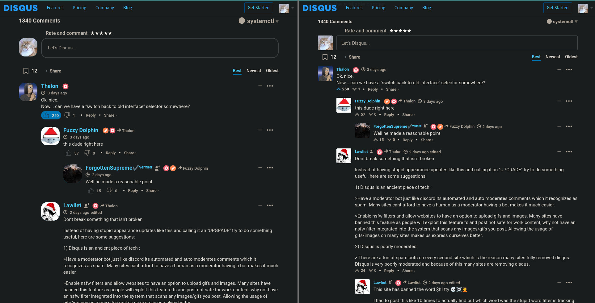

## What / why
Not everyone loves extra-rounded corners and massively blown-up page elements. 
That's why this repo was created.

Initially I tried to bring back exact previous Disqus design, but not being a frontend dev (I'm a backend) I decided 
that small tweaks should also do the job. 
It's not perfect, but at least I will no longer see those UGLY ROUNDED CORNERS. *(sigh)*

So, to install this fix you'll need:
1. Install [TamperMonkey browser extension](https://www.tampermonkey.net/).
2. Then [click this link](https://raw.githubusercontent.com/outofgold/oldschool-disqus/master/dist/disqus.user.js)
(it references to `dist/disqus.user.js` file in this repo) and install script.

Feel free to check out the source code if you have any doubts. 
It's pretty simple - one main TamperMonkey source script file, one CSS file, a bunch of build files and a resulting 
script itself.

## Visual representation

